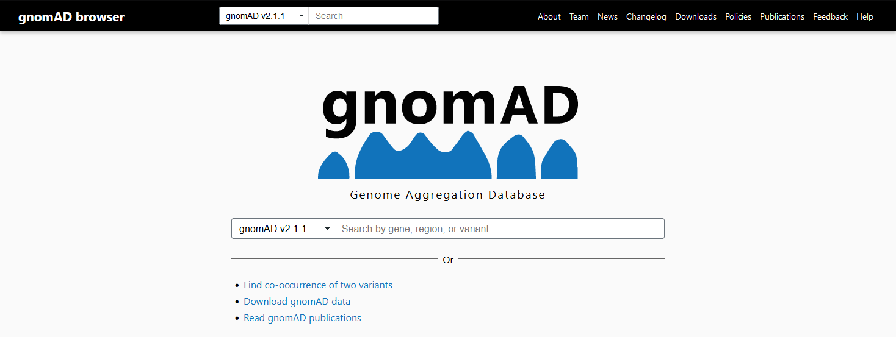
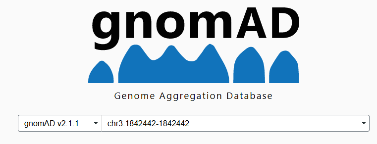
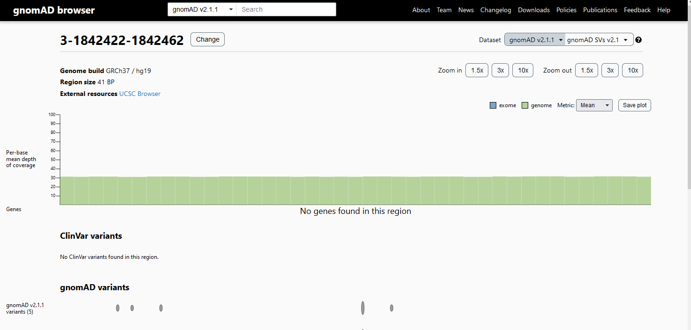

Filtering structural variants in a long read human trio dataset
----------------------------------------

# Overview

# Getting our data

Reference:

VCF:

PED file:

# Initial assessment

Let's look at our VCF and get a basic understanding of it.

- How many variants are there in this VCF?
```


```

- What kind of variants are present in this file? Does it contain all SV types?

```


```


- How does this file look different from the VCF we looked at in the small variant / file formats section?

```


```


- What chromosome(s) do these variants come from? 

```

```


# Filtering our data

Let's filter our data to find **Mendelian Violations**. A Mendelian Violation (or "Mendelian Inheritance Error", MIE)
is when a child contains a genotype that is not present in either of its parents. How could this variant have appeared if it
wasn't inherited?

```


```

To locate Mendelian Violations, we can use the GATK SelectVariants tool.
We need to use a [PED file](https://gatk.broadinstitute.org/hc/en-us/articles/360035531972-PED-Pedigree-format), which describes the relationship between samples in a family.

Which sample corresponds to the child? The mother? The father?

```


```

The GATK command to detect Mendelian Violations is below:

```bash
# From: https://www.biostars.org/p/279427/

gatk \
 SelectVariants \
 --mendelian-violation True \
 -ped family.ped  \
 --output putative_mies.vcf \
 --variant GIAB_Trio.sample.vcf
```

This should produce a file called `putative_mies.vcf`. How many variants are in this file? What genotypes do they have?

```

```

# Looking for common variants in gnomAD

[gnomAD, the Genome Aggregation Database](https://gnomad.broadinstitute.org/) is a large collection of genomes and exomes
that were processed through a single pipeline, with the aggregate variation made public in huge VCF files.

This is a great resource for seeing if your variant has been observed before across many samples.





You can query gnomad using SAMTOOLS-style regions. Here's an example:



This will show you the small variants (SNVs, indels, and MNPs in your region).
To look at the SVs, switch to the SV tab at the top right of the page:




# Looking for common variants in dbVar

The file `supporting_variants_for_nstd186.NCBI_curated_common_SVs.csv` contains common variants from the 
NCBI dbVaR (a database of common structural variants). However, it's in a CSV format that's not very useful for
our study.


Transform this file into a BED file so we can intersect it with our VCF.

First, let's determine which columns we need. The [BED specification can be found here](https://genome.ucsc.edu/FAQ/FAQformat.html#format1).

What columns will we need to extract? Use the header to locate the ones we need.


Next, we need to build a set of commands to convert the CSV to a BED file, using a combination of the UNIX
`cat`, `cut`, `grep`, and `sed` commands.

The `sed` command replace text (for example, `echo "Cats are the best." | sed "s/cat/dog/g"` would replace all instances of "cat" with "dog").

We also need a command to cut the specific columns from a file - `cut` can do this, but we need to tell it the delimiter to use. For a *comma*-separated file, what delimiter should we use?

Try to build a BASH line with these commands to filter our file.


<div style="page-break-after: always;"></div>


Your final command should look like so: 

```bash
cat supporting_variants_for_nstd186.NCBI_curated_common_SVs.csv | \
cut -d "," -f 14,16,19 | \
 sed "s/\"//g" | \
 grep -v ",," | \
 sed "s/,/\t/g" | 
 uniq
```

Now that we have a BED file, we need to see if it's compatible with our VCF.

Do the two share any chromosomes?

**Hint**: We know the file we downloaded is for hg38 (the original is [here](https://www.ncbi.nlm.nih.gov/dbvar/studies/nstd186/download/?type=i)). To add the "chr" prefix to a BED file, use the following command.

```bash
sed "s/^/chr/g" <file>
```

Go ahead and fix our file to have the right chromosome names. Save the new file as `nstd186.NCBI_curated_common_SVs.bed`.

Let's remove any lines with the "|" character, which are from unplaced or decoy chromosomes:

```bash
grep -v "|" nstd186.NCBI_curated_common_SVs.bed > nstd186.NCBI_curated_common_SVs.coreChroms.bed
```

**Finally, remove the header from the BED file using your text editor.** Your final file will be called: `nstd186.NCBI_curated_common_SVs.coreChroms.bed`

## Looking for common variants with BEDTOOLS

We need to convert our VCF to BED, since the SV VCF produced by PBSV is not very friendly with bedtools.

```bash
grep -v "^#" putative_mies.vcf | cut -f 1,2,8 | grep -o ".*END=[0-9]*" | sed "s/END=//g" > putative_mies.bed
```